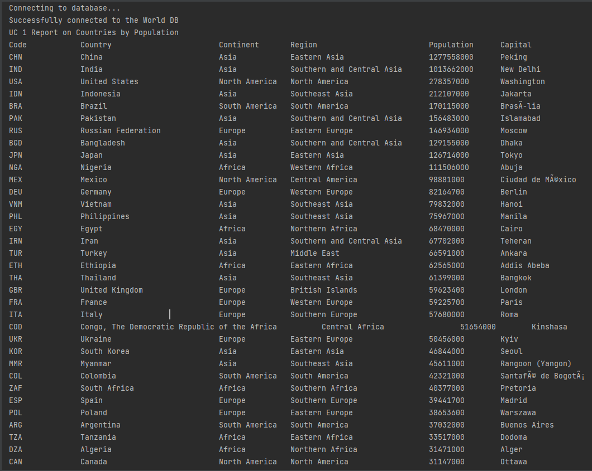

# SET08803-Group1
Welcome to the GitHub page for student group 1 enroled in the SET08803 2021-2 TR2 001 module at Edinburgh Napier University

## Build Badges 
* Master Build Status 
* Develop Build Status 
* Code coverage of tests for
* Release 
* License 

## Group Members
* Natalie Bodley-Jn Baptiste
* Chris Thorpe
* Greg Morris
* Amit Lalloo
* Daniel Nnamdi Onuchukwu
* Olivier Paratte

## Link to zube.io project
https://zube.io/set08803-group1/set08803-assessment/w/workspace-1/kanban

## Requirements Met Overview
| ID    | Name | Met | Screenshot                              |
|-------|------|--|-----------------------------------------|
| 1 | All the countries in the world organised by largest population to smallest | Yes |  |
| 2 | All the countries in a continent organised by largest population to smallest | Yes |  |
| 3 | All the countries in a region organised by largest population to smallest | Yes |  |
| 4 | The top N populated countries in the world where N is provided by the user | Yes |  |
| 5 | The top N populated countries in a continent where N is provided by the user | Yes |  |
| 6 | The top N populated countries in a region where N is provided by the user | Yes | |
| 7 | All the cities in the world organised by largest population to smallest | Yes |  |
| 8 | All the cities in a continent organised by largest population to smallest | Yes |  |
| 9 | All the cities in a region organised by largest population to smallest |  |                                         |
| 10 | All the cities in a country organised by largest population to smallest |  |                                         |
| 11 | All the cities in a district organised by largest population to smallest |  |                                         |
| 12 | The top N populated cities in the world where N is provided by the user | Yes |  |
| 13 | The top N populated cities in a continent where N is provided by the user | Yes |  |
| 14 | The top N populated cities in a region where N is provided by the user | Yes |  |
| 15 | The top N populated cities in a country where N is provided by the user | Yes |  |
| 16 | The top N populated cities in a district where N is provided by the user |  |                                         |
| 17 | All the capital cities in the world organised by largest population to smallest | Yes |  |
| 18 | All the capital cities in a continent organised by largest population to smallest | Yes |  |
| 19 | All the capital cities in a region organised by largest to smallest | Yes |  |
| 20 | The top N populated capital cities in the world where N is provided by the user | Yes |  |
| 21 | The top N populated capital cities in a continent where N is provided by the user | Yes |  |
| 22 | The top N populated capital cities in a region where N is provided by the user | Yes |  |
| 23 | The population of people, people living in cities, and people not living in cities in each continent |  |                                         |
| 24 | The population of people, people living in cities, and people not living in cities in each region |  |                                         |
| 25 | The population of people, people living in cities, and people not living in cities in each country |  |                                         |
| 26 | The population of the world | Yes |  |
| 27 | The population of a continent where the continent is provided by the user |  |                                         |
| 28 | The population of a region where the region is provided by the user |  |                                         |
| 29 | The population of a country where the country is provided by the user |  |                                         |
| 30 | The population of a district where the district is provided by the user |  |                                         |
| 31 | The population of a city where the city is provided by the user |  |                                         |
| 32 | The number of people speaking Chinese, English, Hindi, Spanish and Arabic sorted from greatest number to smallest and including the percentage of the world population |  |                                         |
